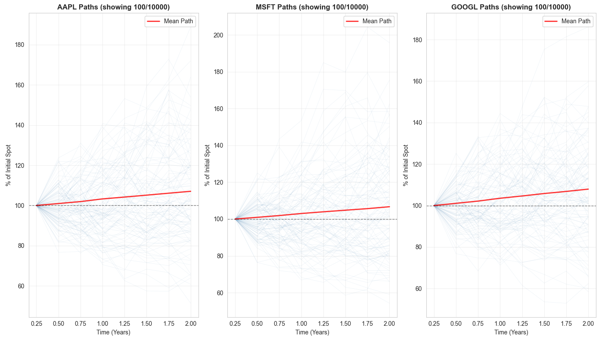
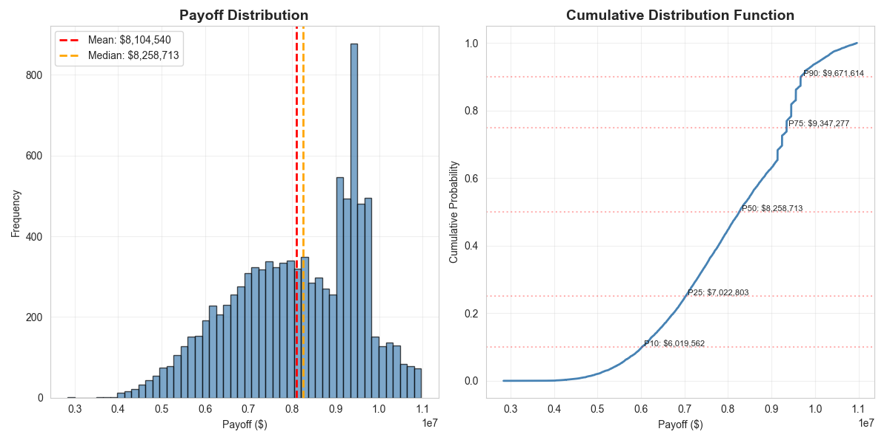

# Personal Research Project CY 26

**Institutional-grade pricing engine.**

A comprehensive pricing engine for OTC derivatives.

In Progress.

## ✅ Pricing Package Features

### Product Definition
- ✅ **Concrete Product Classes**: Concrete products can be defined, such as Phoenix Notes, Snowball Notes.
- ✅ **Compositional Structures**: Structures and be composed and Priced by collating Payoff Components

### Pricing Engine
- ✅ **Flexible Orchestrator Engine**: Engine takes various structure definitions and orchestrates inputs, simulation and analytics.
- ✅ **Monto Carlo Path Generation**: Concrete products can be defined, such as Phoenix Notes, Snowball Notes.

### Input Modelling

#### Volatility Models
- ✅ **SLV (Stochastic Local Vol)**: Two-stage calibration from implied vols (Heston + leverage function)
- ✅ **Local Volatility**: Dupire's formula with finite difference approximation
- ✅ **Heston**: QE variance simulation scheme for numerical stability

#### Correlation Models
- ✅ **Correlation Skew Surface**: State-dependent correlation as function of moneyness (in verification)
- ✅ **Positive-definite enforcement**: Higham's algorithm for valid correlation matrices (in verification)

### Analytics, Risk & Performance
- ✅ **GPU Acceleration**: CuPy backend for 3x speedup
- ✅ **Adjoint Greeks**: Algorithmic differentiation (AAD) for O(1) Greeks (in progress)
- ✅ **Snapshot/Restore**: Save calibrated state for repricing workflows

### Market Data
- ✅ **Yahoo Finance**: Example connector for Yahoo Finance has been included.
- ✅ **Kraken**: Example connector for Kraken Exchange has been included.


## Showcase

### Product Definition

``` python
from prp26.products import AutocallableProduct, Basket, Underlying
from prp26.products.schedules import (
    BarrierSchedule,
    CouponDefinition,
    ObservationSchedule,
)
from prp26.products.taxonomy import TAXONOMY_PHOENIX_AUTOCALLABLE

# Product
basket = Basket(
    underlyings=[Underlying("AAPL"), Underlying("MSFT"), Underlying("GOOGL")],
    weights=[1 / 3, 1 / 3, 1 / 3],
    worst_of=True,
)

product = AutocallableProduct(
    product_id="PHOENIX_VIZ_DEMO",
    currency="USD",
    notional=10_000_000,
    basket=basket,
    observation_schedule=ObservationSchedule(times=[0.25, 0.5, 0.75, 1.0, 1.25, 1.5, 1.75, 2.0]),
    barrier_schedule=BarrierSchedule(
        levels={
            0.25: 1.20,
            0.5: 1.20,
            0.75: 1.20,
            1.0: 1.20,
            1.25: 1.20,
            1.5: 1.20,
            1.75: 1.20,
            2.0: 1.20,
        }
    ),
    coupon=CouponDefinition(rate=0.025, memory=True),
    maturity=2.0,
    taxonomy=TAXONOMY_PHOENIX_AUTOCALLABLE,
)

```
### Path Generation


### Payoff Profile


## Architecture

The engine follows a modular, extensible design:

```
┌─────────────────────────────────────────┐
│         StructuredProduct                │
│  (Product Definition + JSON Schema)      │
└─────────────────────────────────────────┘
                    │
                    ▼
┌─────────────────────────────────────────┐
│          PricingEngine                   │
│  ┌────────────────────────────────────┐ │
│  │  ModelBundle                        │ │
│  │   • VolatilityModel (LV/SLV)      │ │
│  │   • CorrelationModel (Skew)        │ │
│  │   • RateModel                       │ │
│  │   • DividendModel                   │ │
│  └────────────────────────────────────┘ │
│  ┌────────────────────────────────────┐ │
│  │  CalibrationEngine                  │ │
│  │   • SLV two-stage calibration      │ │
│  │   • Correlation from market        │ │
│  └────────────────────────────────────┘ │
│  ┌────────────────────────────────────┐ │
│  │  PathGenerator                      │ │
│  │   • SLV dynamics                    │ │
│  │   • Correlated Brownian motions    │ │
│  │   • GPU-accelerated (optional)     │ │
│  └────────────────────────────────────┘ │
│  ┌────────────────────────────────────┐ │
│  │  PayoffEvaluator                    │ │
│  │   • Snowball coupon state          │ │
│  │   • Early termination              │ │
│  │   • Callability probabilities      │ │
│  └────────────────────────────────────┘ │
│  ┌────────────────────────────────────┐ │
│  │  RiskEngine                         │ │
│  │   • Adjoint Greeks (AAD)           │ │
│  │   • Bump-and-reprice               │ │
│  └────────────────────────────────────┘ │
└─────────────────────────────────────────┘
                    │
                    ▼
┌─────────────────────────────────────────┐
│       PersistenceLayer                   │
│  • EngineSnapshot (save/load)            │
│  • Audit trail                           │
│  • Model versioning                      │
└─────────────────────────────────────────┘
```

## Installation

```bash
# Basic installation
pip install -e .

# With GPU support
pip install -e ".[gpu]"

# Development installation
pip install -e ".[dev]"

# With documentation tools
pip install -e ".[docs]"

# With notebook support
pip install -e ".[notebook]"
```

## Quick Start

See the `docs/` directory for example definitions and pricing flows:

## Project Structure

```
src/prp26/
├── core/              # Pricing engines and path generation
├── products/          # Product definitions
├── models/            # Volatility, correlation, rates, dividends
├── marketdata/        # Market data providers
├── numerics/          # Numerical methods (TBD)
├── gpu/               # GPU acceleration
└── schemas/           # JSON validation schemas (TBD)
```

## Examples

See the `examples/` directory for detailed usage examples:

- `visualization_demo.py` - Basic Phoenix autocall pricing

## Development

```bash
# Run tests
pytest

# Format code
black src/ tests/

# Lint
ruff src/ tests/

# Type check
mypy src/
```

## License

MIT
